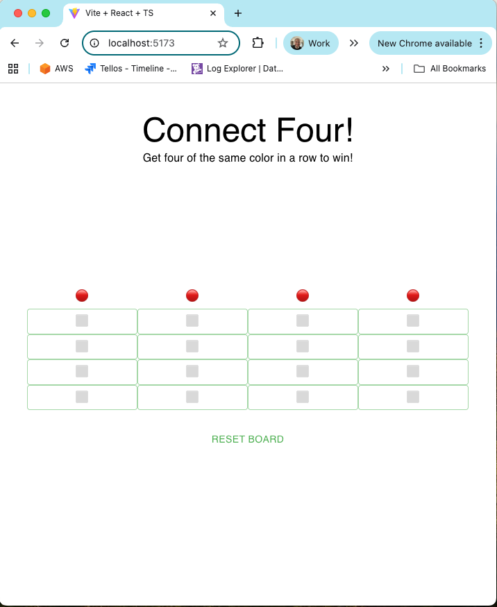
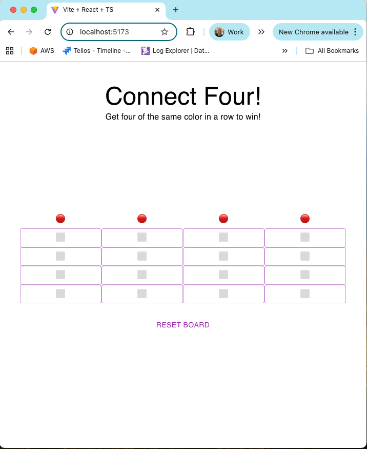

# Connect Four Game Setup

## Quick Start

1. Install dependencies:
```bash
npm i
```

2. Start the development server:
```bash
npm run dev
```

3. Run Test
```bash
npm run test
```

App Demo: https://www.loom.com/share/517cc2158fa74b2bba195c11af4d6c78?sid=a86a5d39-2c59-41dc-9038-299f103ae739

The game will be available at `http://localhost:3000`

# Tellos Frontend Engineer Takehome Test (Instructions)

Welcome to the Tellos Frontend Engineer Takehome Test! This test is designed to evaluate your ability to use Typescript, React and MUI. Your submission will be judged against these criteria:

1. The simplicity of your solution (simpler is better)
2. How closely your solution mirrors the screenshots provided. Spacing and reactivity are important!
3. Appropriate use of Typescript types (submissions that contain use of the `any` type will be rejected)
4. Appropriate use of MUI components (particularly Grid and Button)
5. Tests are a bonus

This test should take you no more than 3 hours.

Please create the project with npm, Vite and the react-ts template.

## Project Description
In this project you will be implementing the Connect Four game. In the Connect Four game, two players (red 🔴 and black ⚫) take turns "dropping" a piece into the board. If there are ever 4 of the same color in a row (horizontally, vertically or diagonally) that player wins!

At any time you should be able to reset the game, which clears the board and sets it to the red player's turn.

If a column is full, no more pieces can be dropped in that column.

When a winner is found:
1. No more pieces can be dropped
2. The winner is displayed
3. The reset button switches to "New Game"

The title should stay in place when the window is resized. The board should track to the center of the window during a resize, both horizontally and vertically.

Icon for Red: 🔴
Icon for Black: ⚫
Icon for Blank space: ⬜


## Themeing
You should also include the ability to change the color of the primary/main palette to purple(500) and green(500). This doesn't need to be dynamic, its ok to make it a constant variable and refresh the screen to show the new palette.




## Submission


To submit your project, either email us a zip file with your project files (we should be able to run it with a simple `npm i && npm run dev`) or send us a link to a github repo so that we can clone and run your project.
